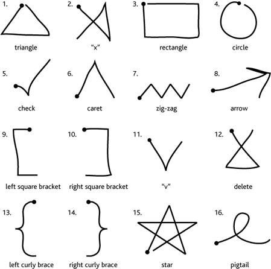

# progetto-pds-backup

The shapes must follow the same drawing order as shown in the figure:

(*source: https://depts.washington.edu/acelab/proj/dollar/index.html*)

As of now we are using the following:
- **rectangle**: initialize backup
- **triangle**: confirm backup
- **delete**: cancel backup